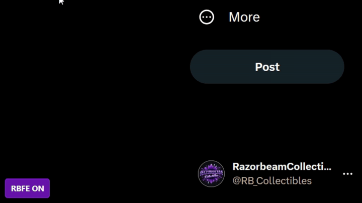

# Razorbeam Filter Evade

Tired of censors and profanity filters? Now you can be a potty-mouthed dumbass. ANYWHERE.

## Highlights

- Instantly converts characters.
- Press Tab to copy
- Browser script that basically does the same thing: automatically converts posts and comments on Twitter, YouTube, and Instagram.
- Entirely open source. Feel free to build it yourself via `run.bat` after you inspect the code. 

# Quick Start Guide

- To use the all-in-one .exe, just click [here](https://github.com/RazorbeamCollectibles/RazorbeamFilterEvade/releases/download/v1.0.11/RazorbeamFilterEvade.exe)
- To use the browser script:
1. Install Tampermonkey in Firefox or Chrome.
2. Open `RazorbeamFilterEvade.user.js`.
3. Create a new Tampermonkey script, paste it, save.

## Interface

Don't like where the button is located? Drag it and move it. 

## Notice
- We aren't responsible if you get banned from somewhere using this. 
- When copypasting text blocks to Twitter, ignore the duplicated portion: the final submission will be clean.
