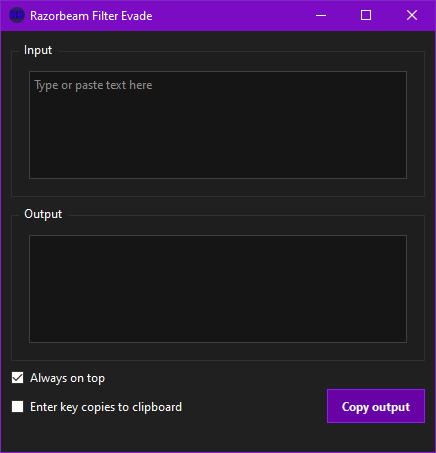

# Razorbeam Filter Evade

Desktop text converter for replacing selected Latin letters with visually similar non-Latin glyphs.

## Highlights

- Instantly converts typed or pasted text.
- Press `Tab` to copy the output.
- Optional `Enter copies to clipboard` mode.
- Remembers window position and checkbox settings.
- Entirely open source. Feel free to build it yourself via run.bat after you inspect the code.

## Quick Start

- Just click [here](https://github.com/RazorbeamCollectibles/RazorbeamFilterEvade/releases/download/v1.1.0/RazorbeamFilterEvade.exe).

## Interface

## Browser Script Status

The Tampermonkey/browser script is discontinued starting with `v1.1.0`.

Reason: Twitter/X, Instagram, and YouTube change their web editors too often. The script became too fragile to ship as a supported feature.

The older browser-script build is still available [here](https://github.com/RazorbeamCollectibles/RazorbeamFilterEvade/releases/tag/v1.0.11) for anyone who wants it.

## Notice

- We are not responsible if you get banned from somewhere using this.
- The desktop app is the supported version going forward.
